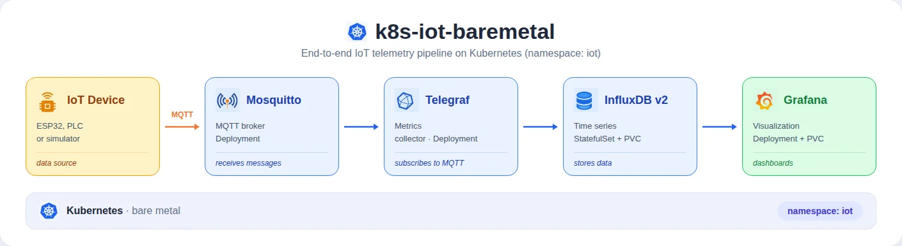
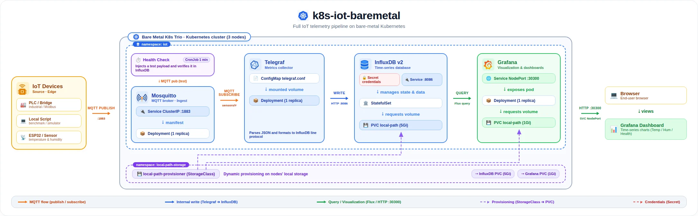
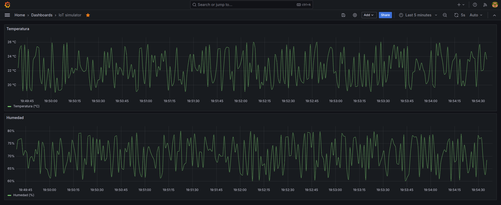
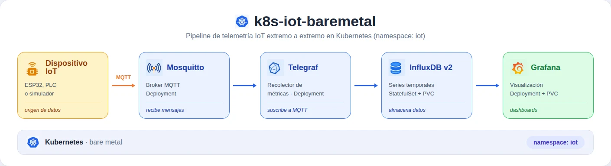
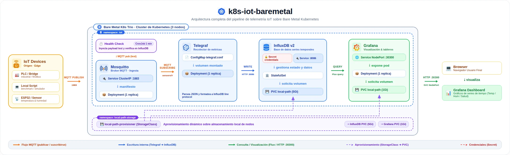

# k8s-iot-baremetal

**Author / Autor**: Mauro Alejandro Pereira
**LinkedIn**: [mauro-alejandro-pereira](https://www.linkedin.com/in/mauro-alejandro-pereira) · **GitHub**: [MauroPereira](https://github.com/MauroPereira) · **X**: [@mauropereira_io](https://x.com/mauropereira_io)

🇺🇸 [English](#english) | 🇦🇷 [Español](#español)

---

## English

### Context

This cluster's goal is to let a group of users store and monitor, in real time, the data from their low-cost IoT devices — PLCs and sensors — without specialized infrastructure or a dedicated operations team.

It provides an automated platform that runs a complete telemetry pipeline (ingestion → storage → visualization) on modest, commodity hardware. This project is a first, working implementation of that platform.

A key advantage: by choosing vanilla Kubernetes as the foundation, the cluster is highly portable to the cloud — for example, AWS — without major architectural redesigns.

### Description

This project provides an automated deployment through bash scripts presented as sequential steps, which configure a production-ready Kubernetes cluster on **bare metal** hardware using **vanilla Kubernetes** (`packages.k8s.io`) and several additional tools.

```
k8s-iot-baremetal/
├── 00_deploy_cluster.sh      # Sets up SSH bootstrap on nodes, deploys the K8s cluster base via Ansible and configures local kubeconfig
├── 01_deploy_iot.sh          # Creates the iot namespace, applies k8s manifests in order and waits for all components to become available
│
├── ansible/                  # Ansible roles that configure each cluster node
│
├── k8s/                      # Kubernetes manifests for each component, managed by ArgoCD
│   ├── mosquitto/            # MQTT broker that receives messages from IoT devices
│   ├── influxdb/             # Time-series database where pipeline data is stored
│   ├── telegraf/             # Metrics collector that subscribes to the MQTT broker and writes data to InfluxDB
│   ├── grafana/              # Data visualization dashboards
│   ├── healthcheck/          # CronJob that verifies the full pipeline every 1 minute
│   └── storage/              # local-path-provisioner StorageClass manifest for cluster PVCs
│
├── tools/                    # Scripts to launch and configure tools running on the cluster
│   ├── 00_launch_headlamp.sh              # Installs and launches Headlamp, a desktop UI for cluster management
│   ├── 01_setup_argocd_iot_pipeline.sh    # Installs ArgoCD and configures the Application managing the IoT pipeline
│   ├── 02_setup_argocd_storage.sh         # Configures the ArgoCD Application managing cluster storage
│   ├── 03_setup_argocd_notifications.sh   # Configures ArgoCD notifications to a Discord channel
│   └── 04_setup_influxdb.sh               # Creates InfluxDB Secrets and generates access tokens for Telegraf and Grafana
│
└── tests/                    # Validation, benchmarking and IoT pipeline simulation scripts
    ├── 00_test_mosquitto.sh    # Smoke test that validates the full publish/subscribe cycle on the MQTT broker
    ├── 01_bench_mosquitto.sh   # Measures broker throughput and latency with 20 simultaneous clients
    └── 02_iot_simulator.sh     # Simulates an IoT device publishing temperature and humidity to Mosquitto
```

### Architecture

<p align="center">
  
  <br/>
  <em>Reduced architecture</em>
</p>

<p align="center">
  
  <br/>
  <em>Full architecture</em>
</p>

### Currently deployed
- 3-node Kubernetes 1.32 cluster (control-plane + 2× worker), automated via Ansible (`kubeadm`, `containerd`, Cilium CNI)
- Local storage via `local-path-provisioner`
- GitOps with ArgoCD for automated manifest deployments (auto-sync + self-heal) and Discord notifications
- End-to-end IoT telemetry pipeline: Mosquitto → Telegraf → InfluxDB v2 → Grafana
- Automated health check (CronJob) and control dashboard in Grafana

### Next steps
- Real hardware validation: the pipeline has been tested with a simulator (script) so far; validation with physical IoT devices (ESP32 boards, PLC via MQTT bridge) is pending.
- Broker exposure: Mosquitto is currently a `ClusterIP` service (cluster-internal only); connecting real devices requires exposing it on the local network, at minimum via `NodePort` on port 1883.
- Security: TLS on MQTT, Mosquitto authentication, Ingress controller
- Multi-user: login system for per-user data persistence.
- Backup: periodic storage snapshots to handle failures and accidental data deletion by users.
- Custom dashboards: easy deployment of user-defined dashboards.

### Tests

#### Smoke test — `00_test_mosquitto.sh`

Validates that the Mosquitto broker is active and responding. Runs three publish/subscribe rounds on the `test/smoke` topic and verifies each message is received correctly. If the broker is down, the test detects it and exits with an error.

```bash
./k8s-iot-baremetal/tests/00_test_mosquitto.sh
```

#### Performance benchmark — `01_bench_mosquitto.sh`

Measures Mosquitto throughput and latency under simultaneous load from 20 clients. Requires an active `kubectl port-forward` before running. Automatically installs [`mqtt-benchmark`](https://github.com/krylovsk/mqtt-benchmark) via Go if missing.

| Parameter | Value | Description |
|-----------|-------|-------------|
| `CLIENTS` | 20 | Simulated IoT devices publishing concurrently |
| `COUNT` | 120 | Messages per client — at 1 msg/sec ≈ 2 min runtime |
| `SIZE` | 64 bytes | Typical IoT sensor JSON payload (e.g. `{"sensor":"temp","value":23.4}`) |
| `INTERVAL_SECS` | 1 | Seconds between messages per client — realistic for temperature/humidity sensors |
| `QOS` | 0 | Fire and forget — no delivery confirmation, minimal overhead, IoT standard |

Total load: **20 msg/sec** to the broker for ~2 minutes.

```bash
# Terminal 1
kubectl port-forward svc/mosquitto 1883:1883 -n iot

# Terminal 2
./k8s-iot-baremetal/tests/01_bench_mosquitto.sh
```

##### Results vs industry reference

| Metric | Our result | Industry reference | Assessment |
|--------|------------|--------------------|------------|
| Delivery ratio | 1.000 (2400/2400) | 1.000 optimal | ✓ Perfect |
| Average latency | ~0.08 ms | 2–15 ms acceptable, <10 ms good | ✓ Exceptional (25–100× better) |
| Peak latency | 1.05 ms | <10 ms good | ✓ Excellent |
| Total throughput | ~20 msg/sec | Up to 37k–82k msg/sec (Mosquitto at full load) | — Not intentionally stress-tested |

> **Note:** this test is intentionally not a throughput stress test — it simulates a realistic IoT load (20 devices at 1 msg/sec). Mosquitto on modest hardware can handle tens of thousands of msg/sec at full load. Sub-millisecond latency confirms the broker is healthy and well within its operating range.
>
> Reference: [MQTT Brokers at Scale: Performance Tuning Mosquitto, HiveMQ, and EMQX — Java Code Geeks, August 2025](https://www.javacodegeeks.com/2025/08/mqtt-brokers-at-scale-performance-tuning-mosquitto-hivemq-and-emqx.html)

#### IoT Simulator — `02_iot_simulator.sh`

Simulates an IoT device publishing temperature and humidity to Mosquitto once per second, with values within realistic ranges. Allows end-to-end pipeline validation — from MQTT publishing to Grafana visualization — without physical hardware.

```bash
./k8s-iot-baremetal/tests/02_iot_simulator.sh
```

##### Result



### License

© 2026 Mauro A. Pereira. Source code published for portfolio and evaluation purposes. See [LICENSE](LICENSE) for terms of use.

---

## Español

### Contexto

El objetivo de este clúster es permitir que un grupo de usuarios guarde y monitoree en tiempo real la información de sus dispositivos IoT de bajo costo — PLCs y sensores — sin infraestructura especializada ni un equipo de operaciones dedicado.

Provee una plataforma automatizada que corre un pipeline de telemetría completo (recepción → almacenamiento → visualización) sobre hardware modesto y accesible. Este proyecto es una primera implementación funcional de esa plataforma.

Un plus: al elegir Kubernetes vanilla como base, el clúster es altamente migrable a la nube — por ejemplo, AWS — sin necesidad de grandes rediseños de arquitectura.

### Descripción

Este proyecto provee un despliegue automático a través de bash scripts presentados como pasos consecutivos, que configuran un cluster de Kubernetes listo para producción sobre hardware **bare metal**, usando **Kubernetes vanilla** (`packages.k8s.io`) y varias herramientas más.

```
k8s-iot-baremetal/
├── 00_deploy_cluster.sh      # Implementa un bootstrap SSH en los nodos, despliega la base de un clúster K8s vía Ansible y configura el kubeconfig local
├── 01_deploy_iot.sh          # Crea el namespace iot, aplica los manifiestos de la carpeta k8s en orden y espera a que todos queden disponibles
│
├── ansible/                  # Contiene los roles de Ansible que configuran cada nodo del clúster
│
├── k8s/                      # Manifiestos de Kubernetes de cada componente, gestionados por ArgoCD
│   ├── mosquitto/            # Broker MQTT que recibe mensajes de los dispositivos IoT
│   ├── influxdb/             # Base de datos de series temporales donde se almacenan los datos del pipeline
│   ├── telegraf/             # Agente recolector de métricas que se suscribe al broker MQTT y escribe los datos en InfluxDB
│   ├── grafana/              # Dashboards de visualización de datos
│   ├── healthcheck/          # CronJob que verifica el funcionamiento del pipeline completo cada 1 minuto
│   └── storage/              # Manifiesto del StorageClass local-path-provisioner para los PVCs del clúster
│
├── tools/                    # Scripts para lanzar y configurar herramientas que corren sobre el cluster
│   ├── 00_launch_headlamp.sh              # Instala y lanza Headlamp, una UI desktop para gestionar el clúster
│   ├── 01_setup_argocd_iot_pipeline.sh    # Instala ArgoCD y configura la Application que gestiona el pipeline IoT
│   ├── 02_setup_argocd_storage.sh         # Configura la Application de ArgoCD que gestiona el almacenamiento del clúster
│   ├── 03_setup_argocd_notifications.sh   # Configura las notificaciones de ArgoCD hacia un canal de Discord
│   └── 04_setup_influxdb.sh               # Crea los Secrets de InfluxDB y genera los tokens de acceso para Telegraf y Grafana
│
└── tests/                    # Scripts de validación, benchmarking y simulación del pipeline IoT
    ├── 00_test_mosquitto.sh    # Smoke test que valida el ciclo completo de publicación y recepción de mensajes en el broker MQTT
    ├── 01_bench_mosquitto.sh   # Mide el throughput y la latencia del broker con 20 clientes simultáneos
    └── 02_iot_simulator.sh     # Simula un dispositivo IoT publicando temperatura y humedad a Mosquitto
```

### Arquitectura

<p align="center">
  
  <br/>
  <em>Arquitectura reducida</em>
</p>

<p align="center">
  
  <br/>
  <em>Arquitectura completa</em>
</p>

### Desplegado actualmente
- Clúster Kubernetes 1.32 de 3 nodos (control-plane + 2x worker), automatizado vía Ansible (`kubeadm`, `containerd`, Cilium CNI)
- Almacenamiento local vía `local-path-provisioner`
- GitOps con ArgoCD para despliegues automáticos de manifiestos (sync automatizado + self-heal) y notificaciones a Discord
- Pipeline de telemetría IoT end-to-end: Mosquitto → Telegraf → InfluxDB v2 → Grafana
- Health check automatizado (CronJob) y dashboard de control en Grafana

### Próximos pasos
- Validación con hardware real: hasta ahora el pipeline fue probado con un simulador (script); falta validar con dispositivos IoT físicos (placas ESP32, PLC vía bridge MQTT).
- Exposición del broker: Mosquitto está actualmente como `ClusterIP` (solo interno al cluster); para conectar dispositivos reales hace falta exponerlo en la red local, al menos vía `NodePort` en el puerto 1883.
- Seguridad: TLS en MQTT, autenticación de Mosquitto, Ingress controller
- Multiusuario: sistema de logueo para persistencia de datos por usuario.
- Backup: guardados periódicos del almacenamiento de datos ante caídas y borrados accidentales por parte de los usuarios.
- Tableros personalizados: despliegue de tableros customizados de forma fácil.

### Pruebas

#### Smoke test — `00_test_mosquitto.sh`

Valida que el broker Mosquitto esté activo y respondiendo. Ejecuta tres rondas de publicación y suscripción en el topic `test/smoke` y verifica que cada mensaje llegue correctamente. Si el broker está caído, el test lo detecta y sale con error.

```bash
./k8s-iot-baremetal/tests/00_test_mosquitto.sh
```

#### Benchmark de rendimiento — `01_bench_mosquitto.sh`

Mide el throughput y la latencia de Mosquitto bajo carga simultánea de 20 clientes. Requiere `kubectl port-forward` activo antes de ejecutarse. Instala [`mqtt-benchmark`](https://github.com/krylovsk/mqtt-benchmark) automáticamente vía Go si falta.

| Parámetro | Valor | Descripción |
|-----------|-------|-------------|
| `CLIENTS` | 20 | Dispositivos IoT simulados publicando concurrentemente |
| `COUNT` | 120 | Mensajes por cliente — a 1 msg/seg ≈ 2 min de ejecución |
| `SIZE` | 64 bytes | Payload JSON típico de sensor IoT (ej. `{"sensor":"temp","value":23.4}`) |
| `INTERVAL_SECS` | 1 | Segundos entre mensajes por cliente — realista para sensores de temperatura/humedad |
| `QOS` | 0 | Fire and forget — sin confirmación de entrega, mínimo overhead, estándar para IoT |

Carga total: **20 msg/seg** al broker durante ~2 minutos.

```bash
# Terminal 1
kubectl port-forward svc/mosquitto 1883:1883 -n iot

# Terminal 2
./k8s-iot-baremetal/tests/01_bench_mosquitto.sh
```

##### Resultados vs referencia de la industria

| Métrica | Nuestro resultado | Referencia de la industria | Evaluación |
|--------|------------|-------------------|------------|
| Delivery ratio | 1.000 (2400/2400) | 1.000 óptimo | ✓ Perfecto |
| Latencia promedio | ~0.08 ms | 2–15 ms aceptable, <10 ms bueno | ✓ Excepcional (25–100× mejor) |
| Latencia máxima | 1.05 ms | <10 ms bueno | ✓ Excelente |
| Throughput total | ~20 msg/seg | Hasta 37k–82k msg/seg (Mosquitto a carga plena) | — No se buscan límites (a propósito) |

> **Nota:** el test intencionalmente no es un stress test de throughput — simula una carga IoT realista (20 dispositivos a 1 msg/seg). Mosquitto en hardware modesto puede manejar decenas de miles de msg/seg a carga plena. La latencia sub-milisegundo confirma que el broker está saludable y bien dentro de su rango operativo.
>
> Referencia: [MQTT Brokers at Scale: Performance Tuning Mosquitto, HiveMQ, and EMQX — Java Code Geeks, agosto 2025](https://www.javacodegeeks.com/2025/08/mqtt-brokers-at-scale-performance-tuning-mosquitto-hivemq-and-emqx.html)

#### Simulador IoT — `02_iot_simulator.sh`

Simula un dispositivo IoT publicando temperatura y humedad a Mosquitto una vez por segundo, con valores dentro de rangos realistas. Permite validar el pipeline de extremo a extremo — desde la publicación MQTT hasta la visualización en Grafana — sin necesidad de hardware físico.

```bash
./k8s-iot-baremetal/tests/02_iot_simulator.sh
```

##### Resultado


### Licencia

© 2026 Mauro A. Pereira. Código publicado con fines de portfolio y evaluación. Consultar [LICENSE](LICENSE) para los términos de uso.
